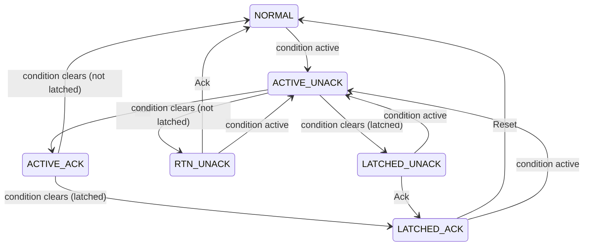

# Alarm model

Package [alarm](../alarm/) implements one alarm's ISA-18.2 / IEC 62682 state
model. It is the Go port of the `BG_ALM_DIG` function block in
[reference/digital_alarm.st](../reference/digital_alarm.st), without the
condition filtering, which lives in the [evaluator](conditions.md).

## States

| Value | State | ISA | Meaning |
|---|---|---|---|
| 0 | `NORMAL` | A | Condition clear, nothing to acknowledge |
| 1 | `ACTIVE_UNACK` | B | Condition active, unacknowledged |
| 2 | `ACTIVE_ACK` | C | Condition active, acknowledged |
| 3 | `RTN_UNACK` | D | Condition cleared before it was acknowledged |
| 4 | `LATCHED_UNACK` | E | Latched: condition cleared, unacknowledged |
| 5 | `LATCHED_ACK` | E | Latched: condition cleared, acknowledged, waiting for reset |
| 6 | `SHELVED` | F | Hidden by an operator for a limited time |
| 7 | `SUPPRESSED` | G | Suppressed by design |
| 8 | `OUT_OF_SERVICE` | H | Disabled, e.g. for maintenance |

States 0–5 are the alarm state. States 6–8 are shown instead when the alarm is
hidden, in the order out of service, suppressed, shelved.

## Transitions

- With `AckRequired` false an activation goes straight to `ACTIVE_ACK`, so
  `RTN_UNACK` and `LATCHED_UNACK` are never reached.
- A latched alarm stays in alarm after the condition clears until it is
  acknowledged and reset. An Ack and a Reset in the same tag command clear it
  in one step, because Ack runs first.
- Every activation increments the alarm count and sets `InAlarmTime`.

## Hiding an alarm

| Command | Effect | Ends when |
|---|---|---|
| `Shelve(user, d, oneShot)` | `SHELVED` | `d` elapses (capped at `MaxShelve`), `Unshelve`, the condition returns to normal (one-shot), or `Disable` |
| `Suppress` | `SUPPRESSED` | `Unsuppress` |
| `Disable` | `OUT_OF_SERVICE`; ends a shelve | `Enable` |

While hidden the alarm state is held at `NORMAL`. When the alarm is shown again
and its condition is still active, it is re-annunciated as `ACTIVE_UNACK`.

Shelving rules:

- `MaxShelve` zero: shelving is not permitted (`ErrShelveNotPermitted`).
- Not allowed while out of service (`ErrOutOfService`).
- One-shot shelving needs an active condition (`ErrNotActive`).
- Shelving again restarts the shelve with the new duration.

## Commands and errors

| Command | Allowed when | Otherwise |
|---|---|---|
| `Ack` | `ACTIVE_UNACK`, `RTN_UNACK`, `LATCHED_UNACK` | `ErrNotUnacked`; `ErrOutOfService` when disabled |
| `Reset` | `LATCHED_ACK` | `ErrNotResettable` |
| `Shelve` | see above | see above |
| `Unshelve`, `Suppress`, `Unsuppress`, `Disable`, `Enable` | always | no-op if already in that mode |
| `ResetCount` | always | |

## Chattering

With `ChatterCount` > 0 the alarm is chattering while its last `ChatterCount`
condition activations all fall within `ChatterWindow`. Activations are counted
also while the alarm is hidden. `Tick` clears chattering once the oldest
activation leaves the window.

## Priority

| Severity | Priority |
|---|---|
| 1–250 | 4 Low |
| 251–500 | 3 Medium |
| 501–750 | 2 High |
| 751–1000 | 1 Urgent |

## Events

Every state change returns an `Event`:

| Kind | Raised by |
|---|---|
| `ACTIVATED` | condition becomes active (or re-annunciation) |
| `RTN` | condition clears |
| `ACKNOWLEDGED`, `RESET` | operator |
| `SHELVED`, `UNSHELVED` | operator, expiry (`Detail: "expired"`), one-shot (`"condition returned to normal"`), out of service |
| `SUPPRESSED`, `UNSUPPRESSED`, `DISABLED`, `ENABLED` | operator or logic |
| `CHATTER_STARTED`, `CHATTER_ENDED` | chatter detection |
| `COUNT_RESET` | operator |

An event records the alarm, description, kind, the displayed state before
and after, priority, user, detail, `Time` and `SourceTime`.
