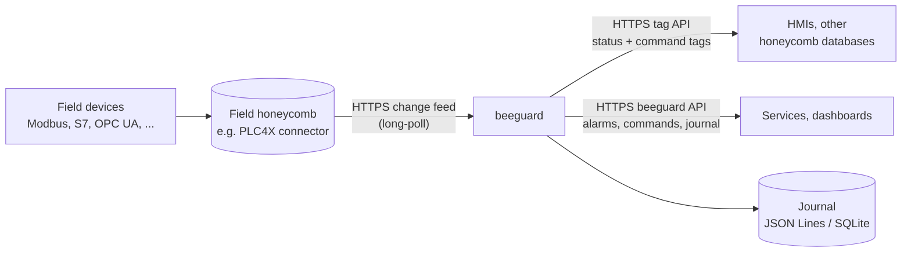
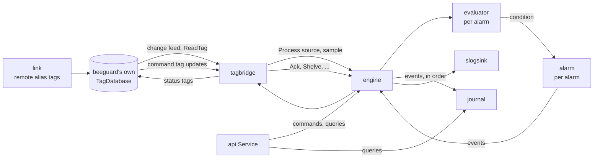

# Architecture

beeguard is an alarm and event server built on
[honeycomb](https://github.com/apiarytech/honeycomb) tag databases. It links
to the honeycomb databases that hold field values, decides which alarms those
values raise, records every alarm event, and offers the alarms to other
systems over two HTTPS APIs.

## Deployment



beeguard does not talk to devices. A field-side program serves a honeycomb
TagDatabase; beeguard links to it as a remote database, the same way one
honeycomb database links to another. Several field databases can be linked at
once. [examples/guard/field](../examples/guard/field/) is a field program that
uses the PLC4X connector; it is a separate Go module, so beeguard itself has no
PLC4X dependency.

## Data flow inside beeguard



1. **link** registers each remote database (`NetworkDatabaseClient`) and creates
   a local remote-alias tag for each linked tag.
2. The **tag bridge** follows each linked database's **change feed**: a
   long-poll request returns every change of the linked tags, in order, with
   value, quality and device timestamp. It reads current values (one `ReadTags`
   request per database, or `ReadTag` per tag on older servers)
   when it starts and after a gap or a failed request. A database without a
   feed is polled with `ReadTag` every `-poll` (1 s); a local tag is subscribed
   to. A source that cannot be read becomes a bad-quality sample.
3. The **engine** passes each sample to the alarms on that source: the
   **evaluator** turns it into a condition, the **alarm** applies the ISA-18.2
   state model and returns **events**.
4. The engine delivers the events, in order, to every **sink**: the journal,
   the slog logger and the tag bridge, which rewrites the alarm's status tag.
5. Operators send commands either through command tags (honeycomb tag API) or
   through the **beeguard API**; both end up as engine commands.

## Packages

```
beeguard/
├── alarm/               ISA-18.2 state machine for one alarm              (pure)
├── evaluator/           value → condition for one alarm                   (pure)
├── engine/              runs all alarms, commands, ordered event sinks    (pure)
├── api/                 transport-neutral service interface
│   └── httpapi/         the service as HTTPS/JSON (standard library)
├── link/                links to remote honeycomb databases
├── tagbridge/           sources, status tags, command tags
├── journal/             journal interface + in-memory journal
│   ├── filejournal/     JSON Lines file (standard library)
│   └── sqljournal/      SQL databases through database/sql
├── sink/slogsink/       event log through log/slog
├── config/              JSON alarm definitions → engine.Definition
├── internal/devcert/    self-signed certificate for development
├── internal/modbus_sim/ Modbus TCP server + simulated guard device (package modbussim)
├── cmd/beeguard/        the server
├── cmd/modbus_sim/      runs the simulator
├── examples/guard/      configs; field/ is a separate module using PLC4X
├── scripts/             third-party license generator
├── reference/           Structured Text function blocks the model was ported from
└── archive/             superseded Structured Text versions
```

Dependencies point one way. `alarm` and `evaluator` depend on nothing in
beeguard; `engine` depends on both; `api`, the journals, the sink, the bridge
and `config` depend on `engine` or `alarm`. Only `link`, `tagbridge` and
`cmd/beeguard` know about honeycomb. Nothing in the main module knows about
PLC4X, and the default build links no third-party module other than honeycomb
and royaljelly.

| Package | Key types | Notes |
|---|---|---|
| `alarm` | `Alarm`, `Config`, `State`, `Priority`, `Event`, `Status` | Methods take the current time and return events. |
| `evaluator` | `Evaluator`, `Config`, `Kind`, `Sample` | `Update(sample, now)` and `Tick(now)`. |
| `engine` | `Engine`, `Definition`, `Sink` | Thread-safe. `Run` wakes at the next deadline. |
| `api` | `Service`, `Alarm`, `Event`, `CommandRequest`, `EventQuery`, `Error` | What other systems use; see [api.md](api.md). |
| `link` | `Config`, `Database`, `Tag` | HTTPS only, optional CA file, token from the environment. |
| `tagbridge` | `Bridge`, `AlarmStatus`, `AlarmCommand` | Engine sink and honeycomb reader. |
| `journal` | `Journal`, `Filter`, `Memory` | A journal is an `engine.Sink` with `Query`. |

## Time

The pure packages never read the clock. The engine reads it once per call and
passes it down. Each event carries `Time` (when beeguard recorded it) and
`SourceTime` (the device timestamp of the value that caused it, carried across
the HTTPS link by `ReadTag`).

Delays and rates are evaluated in **device time** (`-source-time-skew`, 5 s):
a sample is evaluated at its device timestamp when that is within the skew of
the server clock, so changes that arrive together are timed as they happened
in the field. Evaluation time never goes backwards for an alarm.

The engine is **deadline-driven**: `engine.Run` sleeps until the earliest
pending deadline (an on- or off-delay, a rate measurement, a shelve expiry, the
end of chattering) and wakes early when a sample or command creates an earlier
one; `-tick` (1 s) is only the longest sleep. A field change therefore reaches
an alarm within milliseconds of the field database recording it, and delays
end on time.

## Concurrency

```
feed goroutine per linked db ─┐
goroutine per local source ───┤
goroutine per command tag ────┼──► engine.mu  (alarms, evaluators, event queue)
API request goroutines ───────┤          │
engine.Run (next deadline) ───┘          ▼
                                  engine.pubMu (one publisher at a time)
                                         │
                                         ▼
                          sinks: journal → slog → tagbridge
```

Events are queued under `engine.mu`; the goroutine that produced them then
takes `pubMu` and publishes the queue. `pubMu` is never taken while holding
`mu`, so sinks can read the engine. A call such as an API `ack` returns after
its events reach every sink. See [decisions.md](decisions.md#d-12-events-are-delivered-in-order-through-a-queue).

## Startup and shutdown (`cmd/beeguard`)

1. Load the links and the alarm definitions; check the token and certificate.
2. Create beeguard's TagDatabase and apply the links (remote databases and alias tags).
3. Open the journal by file extension: `.jsonl`, or `.db`/`.sqlite` in a
   `-tags sqlite` build; empty keeps it in memory.
4. Build the engine with its sinks: journal, slog, tag bridge.
5. `bridge.Setup()` checks the source tags and creates status and command tags.
6. Start honeycomb's tag API (`-tags-port`) and the beeguard API (`-api-port`).
7. Run the bridge, the engine scheduler and the API server until Ctrl+C. If one
   fails, the others stop and the error is returned.

Alarm state lives only in memory; see [decisions.md](decisions.md#d-23-alarm-state-is-not-persisted).
